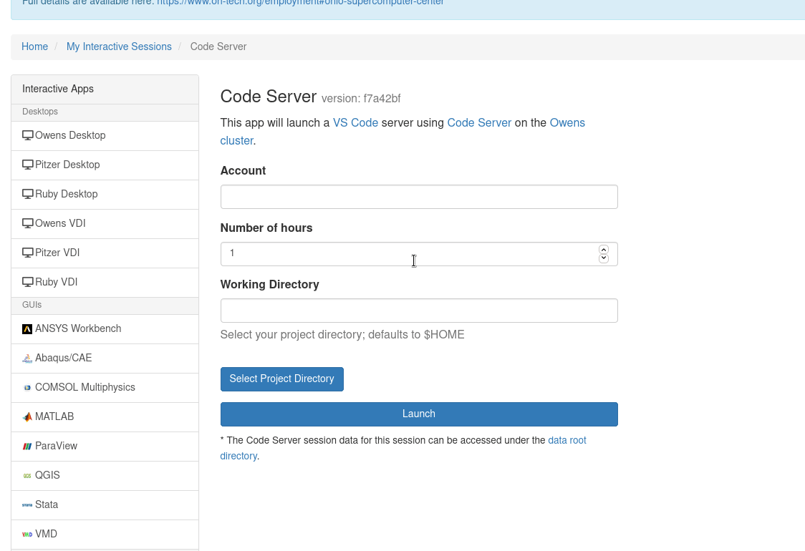

# Batch Connect - JS File Picker


[](https://github.com/OSC/bc_js_filepicker/actions/workflows/release.yml)
[](https://opensource.org/licenses/MIT)

A file picker for use with Batch Connect applications.

## Demo ##



## Usage ##

Download the latest release of [`form.js`](https://github.com/OSC/bc_js_filepicker/releases/latest) and place it in the root directory of your Batch Connect application. For example `/var/www/ood/apps/sys/bc_jupyter/form.js`.

Edit your Batch Connect `form.yml` so that the input you want to add a file picker to has a data attribute named `data-filepicker` with a value of `true`:

```yaml
# form.yml
  input_file:
    label: 'Input File'
    data-filepicker: true
    # Optionally show dot files and folders; defaults to false
    data-show-hidden: true
    # Optionally permit selection of only files or directories; defaults to both
    data-target-file-type: files  # Valid values are: files, dirs, or both
    # Optionally specify a pattern for the name of selectable files or directories; defaults to matching anything
    # Uses JavaScript regular expressions: https://developer.mozilla.org/en-US/docs/Web/JavaScript/Reference/Global_Objects/RegExp
    data-target-file-pattern: \.py$  # python files
    # Optionally provide FS favorites manually
    data-file_picker_favorites: '[{"title": "Team Project", "href": "/fs/project/PZS0714"}]'
    # Optionally set a default directory
    data-default-directory: '/fs/project/PZS0714' 
    # Optionally only allow editing through the file picker; defaults to false
    readonly: true
    # Optionally set a static starting directory by setting the value
    value: /users/mrodgers/my_project/.
```

To navigate into a directory double click the entry. To select a directory just use a single click. The current directory may be filtered, and the filtering engine supports plain text and JavaScript-flavored regular expressions.

## Developing ##

If you have custom logic that you would like to include in your `form.js` then you can clone this project and use it as a base for your own work. This project is managed using [Yarn](https://yarnpkg.com/) and built using [Webpack](https://webpack.js.org/). NodeJS version 10+ is recommended. Note that NodeJS 10+ is only a build-time dependency and OnDemand's regular version of Node does not need to be upgraded in order to use this module.

To setup the project for development run the command:

`yarn install`

To build the project run the command:

`yarn run build`

## Contributing

1. Fork it ( https://github.com/OSC/bc_js_filepicker/fork )
2. Create your feature branch (`git checkout -b my-new-feature`)
3. Commit your changes (`git commit -am 'Add some feature'`)
4. Push to the branch (`git push origin my-new-feature`)
5. Create a new Pull Request
